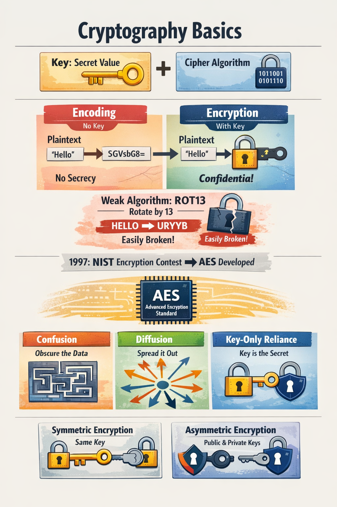
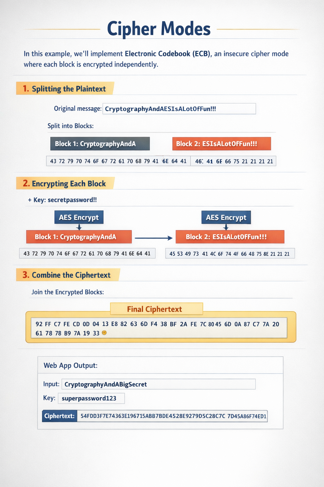

# Encryption and ECB Weakness
Encryption is designed to protect data both at rest (stored) and in transit (transmitted). However, if implemented incorrectly, it can introduce serious vulnerabilities. One common mistake is relying on legacy cipher modes such as Electronic Codebook (ECB).

- Why ECB is insecure
Pattern leakage: ECB encrypts identical plaintext blocks into identical ciphertext blocks. This means patterns in the data remain visible after encryption.

No randomness: Unlike modern modes (CBC, GCM), ECB does not use an initialization vector (IV), so it fails to provide semantic security.

### Example
Imagine encrypting an image with ECB:

- Original image: a bitmap of a penguin.

- Encrypted with ECB: the outline of the penguin is still visible in the ciphertext image because repeating blocks produce repeating ciphertext.

Encrypted with CBC or GCM: the image becomes completely scrambled, hiding all patterns.

 Practical exploitation
Detecting ECB: If ciphertext shows repeating blocks, it’s a sign ECB is in use.

- Attack scenario: An attacker could infer structure or sensitive information (like repeated headers, predictable fields in a database) even without decrypting.

Mitigation: Always use modern, authenticated modes such as AES‑GCM or ChaCha20‑Poly1305.

- Key takeaway: Encryption is only as strong as its implementation. Using insecure modes like ECB can expose patterns and allow attackers to exploit data, even if they don’t know the key.

## Cryptography Basics
Encryption relies on two main components:

Key → a secret value used to encrypt/decrypt data.

Cipher algorithm → the mathematical process that transforms plaintext into ciphertext.

A common confusion is between encoding and encryption:

Encoding: transforms data into another format (e.g., Base64) without a key.

Encryption: transforms data using both an algorithm and a key, ensuring confidentiality.

### Example: ROT13
ROT13 uses a rotation algorithm with a “key” of 13.

It technically qualifies as encryption, but it’s extremely weak since anyone can reverse it easily.

This highlights why relying on secret algorithms (instead of strong keys) is insecure.

- Historical Context
Before 1997, many systems relied on keeping algorithms secret.

NIST organized a competition to create a mathematically secure algorithm where only the key mattered.

Out of this, AES (Advanced Encryption Standard) was born, created by Vincent Rijmen and Joan Daemen.

AES is now the global standard, used in countless applications.

### Core Principles of Secure Encryption

Confusion → obscure the relationship between plaintext and ciphertext.
- Example: AES substitution-permutation networks make it hard to trace input-output relations.

Diffusion → spread out plaintext influence across ciphertext.
- Example: a single bit change in plaintext alters many bits in ciphertext.

Key-only reliance → security depends solely on the secrecy of the key, not the algorithm.
- Example: AES is public, but without the key, ciphertext cannot be decrypted.

### Symmetric vs Asymmetric

Symmetric encryption: same key for encryption and decryption.
- Example: AES — fast and efficient, but requires secure key sharing.

Asymmetric encryption: uses public/private key pairs.
- Example: RSA — slower, but solves the key distribution problem.

#### Key takeaway: Modern cryptography is secure only when it follows the principles of confusion, diffusion, and key-only reliance. AES embodies these principles, but insecure implementations (like ECB mode) can still break confidentiality.




- AES as a Building Block
AES is a secure encryption algorithm, but it should not be used “as is”. Instead, it serves as a building block inside larger symmetric encryption schemes. If those blocks are combined incorrectly, vulnerabilities can arise even though AES itself is mathematically sound.

- Example of insecure use
AES in ECB mode: encrypts identical plaintext blocks into identical ciphertext blocks, leaking patterns.

- AES without authentication: if used only for confidentiality, attackers can manipulate ciphertext (bit flipping) without detection.

- Example of secure use
AES‑GCM: combines AES with Galois/Counter Mode, providing both confidentiality and integrity.

AES‑CBC with HMAC: adds authentication to prevent tampering.

- Key takeaway: AES is strong, but its security depends on how it’s implemented. Using it in insecure modes or without proper authentication can expose systems to attacks.

## Cipher Blocks
### AES and Padding
AES is a block cipher, meaning it encrypts data in fixed-size blocks (128 bits). Messages rarely fit perfectly into these blocks, so padding is added to fill the last block before encryption.

- Example of Padding
Using a custom Python function:
```python
DEFAULT_PADDING_SYMBOL = "*"

def custom_pad(message):
    while len(message) % DEFAULT_BLOCK_SIZE != 0:
        message += DEFAULT_PADDING_SYMBOL
    return message

def custom_unpad(message):
    count = 0
    for x in range(1, len(message)):
        if message[len(message) - x] == DEFAULT_PADDING_SYMBOL:
            count += 1
        else:
            break
    message = message[0:len(message)-count]
    return message
```
- Plaintext: "HELLO"

- Block size: 8

- Padded message: "HELLO***"

This ensures the message fits the required block size.

### Why Padding Matters
Padding is necessary for block ciphers like AES.

If implemented incorrectly, it can lead to security vulnerabilities.

Attackers may exploit padding errors to reveal information about the plaintext.

### Upcoming Topic: Padding Oracles
We will explore Padding Oracle attacks in detail in another section. These attacks exploit insecure padding implementations to decrypt ciphertexts without knowing the key.
[Padding-Oracles Repository](https://github.com/victorhugomierez/Padding-Oracles)

- Key takeaway: AES requires fixed-size blocks, so padding is essential. While padding solves alignment issues, insecure implementations can open the door to attacks such as padding oracles.

Example
- Plaintext message: "HELLO" (5 bytes)

- AES block size: 16 bytes

- Padded message: "HELLO***********" (adds 11 padding symbols to reach 16 bytes)

This ensures the message aligns with AES’s block requirements.

## Cipher Modes
When encrypting with AES, data is split into fixed-size blocks (16 bytes). The question then becomes: how should these blocks be chained together to form the final ciphertext? The method of chaining is called the cipher block mode.

### Electronic Codebook (ECB)

- ECB is one of the simplest cipher modes:

Each block is encrypted independently.

Identical plaintext blocks produce identical ciphertext blocks.

This leaks patterns and makes ECB insecure for most real-world use cases.

- Example: ECB in Action
- Plaintext message:
CryptographyAndAESIsALotOfFun!!! (32 bytes)

Step 1: Split into blocks

Block 1: CryptographyAndA

Block 2: ESIsALotOfFun!!!

Step 2: Convert to bytes
```
Block 1: 43 72 79 70 74 6F 67 72 61 70 68 79 41 6E 64 41

Block 2: 45 53 49 73 41 4C 6F 74 4F 66 46 75 6E 21 21 21
```
Step 3: Encrypt each block independently with AES key secretpassword!!
```
Block 1 ciphertext: 92 FF C7 FE CD 0D 04 13 E8 B2 63 6D F4 38 BF 2A

Block 2 ciphertext: FE 7C 80 45 6D 0A 87 C7 7A 20 61 78 B9 7A 19 33
```
### Step 4: Final ciphertext

```
92 FF C7 FE CD 0D 04 13 E8 B2 63 6D F4 38 BF 2A 
FE 7C 80 45 6D 0A 87 C7 7A 20 61 78 B9 7A 19 33
```
### Python Example (PyCryptodome)
```python
plaintext_bytes = custom_pad(plaintext).encode()
cipher = AES.new(key.encode(), AES.MODE_ECB)
encrypted_bytes = cipher.encrypt(plaintext_bytes)
encrypted_message = binascii.hexlify(encrypted_bytes).decode()
```

### Key Takeaway
ECB is easy to implement but insecure because it does not chain blocks.

Patterns in plaintext remain visible in ciphertext.

Secure alternatives include CBC, CTR, and GCM, which introduce chaining or randomness to hide patterns.




## Problems with ECB Mode
ECB (Electronic Codebook) encrypts each block independently without chaining or diffusion.

This lack of diffusion means patterns in plaintext remain visible in ciphertext.

Identical plaintext blocks produce identical ciphertext blocks.

On small messages, this might not be obvious, but with larger datasets the weakness becomes clear.

    - Example: Plaintext Patterns
Suppose you encrypt a dataset with repeating values (e.g., multiple identical rows in a file).

In ECB, those repeating blocks will produce identical ciphertext blocks.

     - The result: the ciphertext reveals structural patterns of the original data.


## The ECB Penguin Attack
A famous demonstration is encrypting an image of the Linux Tux penguin using ECB.

Because ECB doesn’t diffuse blocks, the encrypted image still resembles the original penguin—only with scrambled colors.

This shows visually how ECB leaks information even though the data is “encrypted.”

### Key Takeaway
ECB is insecure for encrypting large datasets or images because it exposes plaintext patterns.

Secure alternatives like CBC, CTR, or GCM introduce chaining or randomness to hide these patterns.

The ECB Penguin attack is a classic example used in cryptography courses to demonstrate why ECB should never be used in practice.

```python 
from Crypto.Cipher import AES
import binascii

# Configuración
BLOCK_SIZE = 16
key = b'superpassword123'  # clave de ejemplo, debe ser de 16 bytes

# Leer la imagen
with open("test.bmp", "rb") as f:
    data = f.read()

# Padding para que sea múltiplo de 16
pad_len = BLOCK_SIZE - (len(data) % BLOCK_SIZE)
data += bytes([pad_len]) * pad_len

# Cifrado ECB
cipher = AES.new(key, AES.MODE_ECB)
encrypted = cipher.encrypt(data)

# Guardar resultado
with open("test_ecb.bmp", "wb") as f:
    f.write(encrypted)

print("Imagen cifrada guardada como test_ecb.bmp")
```

- Run the script

This will generate a file called test_ecb.bmp.

Compare results
Open test.bmp (original).

Open test_ecb.bmp (encrypted with ECB).

You will notice that, although it is encrypted, the patterns in the original image are still visible.

## What this demonstrates
ECB encrypts each block independently.

Identical blocks produce identical results.

In images, this means that outlines and patterns are preserved.

This is visual proof of why ECB is insecure.

### What cipher principle does ECB not perform sufficiently, leading to it being vulnerable?
- The principle that ECB does not perform sufficiently is diffusion.

- Why diffusion matters
In cryptography, diffusion means that small changes in the plaintext should spread out and affect many parts of the ciphertext.

This ensures that patterns in the original data are hidden and the ciphertext looks random.

- What happens in ECB
ECB encrypts each block independently.

Identical plaintext blocks → identical ciphertext blocks.

As a result, patterns remain visible, especially in structured data like images or large datasets.

- Key takeaway
Because ECB lacks proper diffusion, it leaks structural information about the plaintext. That’s why ECB is considered insecure and is replaced in practice by modes like CBC, CTR, or GCM, which introduce chaining or randomness to achieve strong diffusion.

## chosen-plaintext attack

A common offensive technique against ECB oracles is the chosen-plaintext attack. Because ECB encrypts each block independently, any user-controlled input embedded in the plaintext can be exploited. By carefully crafting input, an attacker can align target bytes within a block and then perform a byte-by-byte brute force to recover the hidden message.

This approach allows the adversary to gradually reconstruct the entire plaintext without knowledge of the encryption key. The attack demonstrates how deterministic block encryption, when exposed through an oracle, can be leveraged to compromise confidentiality.

In this exercise, we will first outline the theoretical basis of the attack, before moving into a hands-on demonstration that highlights its offensive application and the security implications for systems relying on ECB mode.

