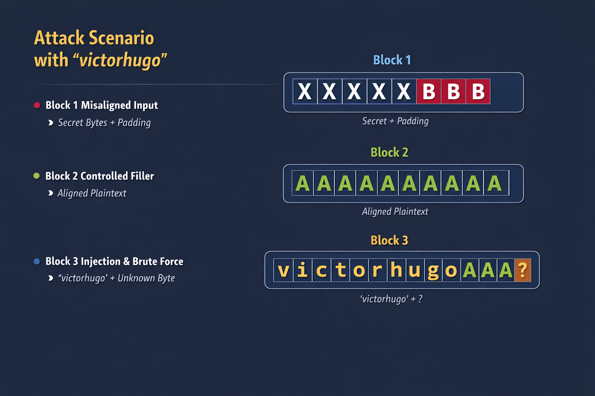

# Encryption and ECB Weakness
Encryption is designed to protect data both at rest (stored) and in transit (transmitted). However, if implemented incorrectly, it can introduce serious vulnerabilities. One common mistake is relying on legacy cipher modes such as Electronic Codebook (ECB).

- Why ECB is insecure
Pattern leakage: ECB encrypts identical plaintext blocks into identical ciphertext blocks. This means patterns in the data remain visible after encryption.

No randomness: Unlike modern modes (CBC, GCM), ECB does not use an initialization vector (IV), so it fails to provide semantic security.

### Example
Imagine encrypting an image with ECB:

- Original image: a bitmap of a penguin.

- Encrypted with ECB: the outline of the penguin is still visible in the ciphertext image because repeating blocks produce repeating ciphertext.

Encrypted with CBC or GCM: the image becomes completely scrambled, hiding all patterns.

 Practical exploitation
Detecting ECB: If ciphertext shows repeating blocks, it’s a sign ECB is in use.

- Attack scenario: An attacker could infer structure or sensitive information (like repeated headers, predictable fields in a database) even without decrypting.

Mitigation: Always use modern, authenticated modes such as AES‑GCM or ChaCha20‑Poly1305.

- Key takeaway: Encryption is only as strong as its implementation. Using insecure modes like ECB can expose patterns and allow attackers to exploit data, even if they don’t know the key.

## Cryptography Basics
Encryption relies on two main components:

Key → a secret value used to encrypt/decrypt data.

Cipher algorithm → the mathematical process that transforms plaintext into ciphertext.

A common confusion is between encoding and encryption:

Encoding: transforms data into another format (e.g., Base64) without a key.

Encryption: transforms data using both an algorithm and a key, ensuring confidentiality.

### Example: ROT13
ROT13 uses a rotation algorithm with a “key” of 13.

It technically qualifies as encryption, but it’s extremely weak since anyone can reverse it easily.

This highlights why relying on secret algorithms (instead of strong keys) is insecure.

- Historical Context
Before 1997, many systems relied on keeping algorithms secret.

NIST organized a competition to create a mathematically secure algorithm where only the key mattered.

Out of this, AES (Advanced Encryption Standard) was born, created by Vincent Rijmen and Joan Daemen.

AES is now the global standard, used in countless applications.

### Core Principles of Secure Encryption

Confusion → obscure the relationship between plaintext and ciphertext.
- Example: AES substitution-permutation networks make it hard to trace input-output relations.

Diffusion → spread out plaintext influence across ciphertext.
- Example: a single bit change in plaintext alters many bits in ciphertext.

Key-only reliance → security depends solely on the secrecy of the key, not the algorithm.
- Example: AES is public, but without the key, ciphertext cannot be decrypted.

### Symmetric vs Asymmetric

Symmetric encryption: same key for encryption and decryption.
- Example: AES — fast and efficient, but requires secure key sharing.

Asymmetric encryption: uses public/private key pairs.
- Example: RSA — slower, but solves the key distribution problem.

#### Key takeaway: Modern cryptography is secure only when it follows the principles of confusion, diffusion, and key-only reliance. AES embodies these principles, but insecure implementations (like ECB mode) can still break confidentiality.


- AES as a Building Block
AES is a secure encryption algorithm, but it should not be used “as is”. Instead, it serves as a building block inside larger symmetric encryption schemes. If those blocks are combined incorrectly, vulnerabilities can arise even though AES itself is mathematically sound.

- Example of insecure use
AES in ECB mode: encrypts identical plaintext blocks into identical ciphertext blocks, leaking patterns.

- AES without authentication: if used only for confidentiality, attackers can manipulate ciphertext (bit flipping) without detection.

- Example of secure use
AES‑GCM: combines AES with Galois/Counter Mode, providing both confidentiality and integrity.

AES‑CBC with HMAC: adds authentication to prevent tampering.

- Key takeaway: AES is strong, but its security depends on how it’s implemented. Using it in insecure modes or without proper authentication can expose systems to attacks.

## Cipher Blocks
### AES and Padding
AES is a block cipher, meaning it encrypts data in fixed-size blocks (128 bits). Messages rarely fit perfectly into these blocks, so padding is added to fill the last block before encryption.

- Example of Padding
Using a custom Python function:
```python
DEFAULT_PADDING_SYMBOL = "*"

def custom_pad(message):
    while len(message) % DEFAULT_BLOCK_SIZE != 0:
        message += DEFAULT_PADDING_SYMBOL
    return message

def custom_unpad(message):
    count = 0
    for x in range(1, len(message)):
        if message[len(message) - x] == DEFAULT_PADDING_SYMBOL:
            count += 1
        else:
            break
    message = message[0:len(message)-count]
    return message
```
- Plaintext: "HELLO"

- Block size: 8

- Padded message: "HELLO***"

This ensures the message fits the required block size.

### Why Padding Matters
Padding is necessary for block ciphers like AES.

If implemented incorrectly, it can lead to security vulnerabilities.

Attackers may exploit padding errors to reveal information about the plaintext.

### Upcoming Topic: Padding Oracles
We will explore Padding Oracle attacks in detail in another section. These attacks exploit insecure padding implementations to decrypt ciphertexts without knowing the key.
[Padding-Oracles Repository](https://github.com/victorhugomierez/Padding-Oracles)

- Key takeaway: AES requires fixed-size blocks, so padding is essential. While padding solves alignment issues, insecure implementations can open the door to attacks such as padding oracles.

Example
- Plaintext message: "HELLO" (5 bytes)

- AES block size: 16 bytes

- Padded message: "HELLO***********" (adds 11 padding symbols to reach 16 bytes)

This ensures the message aligns with AES’s block requirements.

## Cipher Modes
When encrypting with AES, data is split into fixed-size blocks (16 bytes). The question then becomes: how should these blocks be chained together to form the final ciphertext? The method of chaining is called the cipher block mode.

### Electronic Codebook (ECB)

- ECB is one of the simplest cipher modes:

Each block is encrypted independently.

Identical plaintext blocks produce identical ciphertext blocks.

This leaks patterns and makes ECB insecure for most real-world use cases.

- Example: ECB in Action
- Plaintext message:
CryptographyAndAESIsALotOfFun!!! (32 bytes)

Step 1: Split into blocks

Block 1: CryptographyAndA

Block 2: ESIsALotOfFun!!!

Step 2: Convert to bytes
```
Block 1: 43 72 79 70 74 6F 67 72 61 70 68 79 41 6E 64 41

Block 2: 45 53 49 73 41 4C 6F 74 4F 66 46 75 6E 21 21 21
```
Step 3: Encrypt each block independently with AES key secretpassword!!
```
Block 1 ciphertext: 92 FF C7 FE CD 0D 04 13 E8 B2 63 6D F4 38 BF 2A

Block 2 ciphertext: FE 7C 80 45 6D 0A 87 C7 7A 20 61 78 B9 7A 19 33
```
### Step 4: Final ciphertext

```
92 FF C7 FE CD 0D 04 13 E8 B2 63 6D F4 38 BF 2A 
FE 7C 80 45 6D 0A 87 C7 7A 20 61 78 B9 7A 19 33
```
### Python Example (PyCryptodome)
```python
plaintext_bytes = custom_pad(plaintext).encode()
cipher = AES.new(key.encode(), AES.MODE_ECB)
encrypted_bytes = cipher.encrypt(plaintext_bytes)
encrypted_message = binascii.hexlify(encrypted_bytes).decode()
```

### Key Takeaway
ECB is easy to implement but insecure because it does not chain blocks.

Patterns in plaintext remain visible in ciphertext.

Secure alternatives include CBC, CTR, and GCM, which introduce chaining or randomness to hide patterns.


## Problems with ECB Mode
ECB (Electronic Codebook) encrypts each block independently without chaining or diffusion.

This lack of diffusion means patterns in plaintext remain visible in ciphertext.

Identical plaintext blocks produce identical ciphertext blocks.

On small messages, this might not be obvious, but with larger datasets the weakness becomes clear.

    - Example: Plaintext Patterns
Suppose you encrypt a dataset with repeating values (e.g., multiple identical rows in a file).

In ECB, those repeating blocks will produce identical ciphertext blocks.

     - The result: the ciphertext reveals structural patterns of the original data.


## The ECB Penguin Attack
A famous demonstration is encrypting an image of the Linux Tux penguin using ECB.

Because ECB doesn’t diffuse blocks, the encrypted image still resembles the original penguin—only with scrambled colors.

This shows visually how ECB leaks information even though the data is “encrypted.”

### Key Takeaway
ECB is insecure for encrypting large datasets or images because it exposes plaintext patterns.

Secure alternatives like CBC, CTR, or GCM introduce chaining or randomness to hide these patterns.

The ECB Penguin attack is a classic example used in cryptography courses to demonstrate why ECB should never be used in practice.

```python 
from Crypto.Cipher import AES
import binascii

# Configuración
BLOCK_SIZE = 16
key = b'superpassword123'  # clave de ejemplo, debe ser de 16 bytes

# Leer la imagen
with open("test.bmp", "rb") as f:
    data = f.read()

# Padding para que sea múltiplo de 16
pad_len = BLOCK_SIZE - (len(data) % BLOCK_SIZE)
data += bytes([pad_len]) * pad_len

# Cifrado ECB
cipher = AES.new(key, AES.MODE_ECB)
encrypted = cipher.encrypt(data)

# Guardar resultado
with open("test_ecb.bmp", "wb") as f:
    f.write(encrypted)

print("Imagen cifrada guardada como test_ecb.bmp")
```

- Run the script

This will generate a file called test_ecb.bmp.

Compare results
Open test.bmp (original).

Open test_ecb.bmp (encrypted with ECB).

You will notice that, although it is encrypted, the patterns in the original image are still visible.

## What this demonstrates
ECB encrypts each block independently.

Identical blocks produce identical results.

In images, this means that outlines and patterns are preserved.

This is visual proof of why ECB is insecure.

### What cipher principle does ECB not perform sufficiently, leading to it being vulnerable?
- The principle that ECB does not perform sufficiently is diffusion.

- Why diffusion matters
In cryptography, diffusion means that small changes in the plaintext should spread out and affect many parts of the ciphertext.

This ensures that patterns in the original data are hidden and the ciphertext looks random.

- What happens in ECB
ECB encrypts each block independently.

Identical plaintext blocks → identical ciphertext blocks.

As a result, patterns remain visible, especially in structured data like images or large datasets.

- Key takeaway
Because ECB lacks proper diffusion, it leaks structural information about the plaintext. That’s why ECB is considered insecure and is replaced in practice by modes like CBC, CTR, or GCM, which introduce chaining or randomness to achieve strong diffusion.

## chosen-plaintext attack

A common offensive technique against ECB oracles is the chosen-plaintext attack. Because ECB encrypts each block independently, any user-controlled input embedded in the plaintext can be exploited. By carefully crafting input, an attacker can align target bytes within a block and then perform a byte-by-byte brute force to recover the hidden message.

This approach allows the adversary to gradually reconstruct the entire plaintext without knowledge of the encryption key. The attack demonstrates how deterministic block encryption, when exposed through an oracle, can be leveraged to compromise confidentiality.

In this exercise, we will first outline the theoretical basis of the attack, before moving into a hands-on demonstration that highlights its offensive application and the security implications for systems relying on ECB mode.

## Theoretical Understanding – Chosen-Plaintext Attack on ECB Oracles
In offensive security, a common technique against ECB oracles is the chosen-plaintext attack. Because ECB encrypts each block independently, any user-controlled input embedded in the plaintext can be exploited. By carefully crafting input, an attacker can align target bytes within a block and then perform a byte-by-byte brute force to recover hidden values.

### Example Scenario
Suppose we have an ECB oracle that generates a secret token by concatenating a securely kept value with our username:

```bash
token = ECB("Victorhugo" + username + "Victorhugo")
```

If we submit the username "A", the oracle produces the following ciphertext:

```bash
Ciphertext: 92878b56ece593605c6108b7e62a08457d05ebd1dc98423dc6399c0bcd6903bb
```

- Attack Strategy
Alignment  
By controlling the username input, the attacker can shift the position of the secret string (Victorhugo) into a predictable block boundary.

- Brute Force

    The attacker submits candidate inputs one byte at a time.

    Each candidate is encrypted by the oracle.

    The resulting ciphertext block is compared against the target block.

    A match reveals the correct byte of the secret.

- Iteration  
This process is repeated for each subsequent byte until the entire secret string is reconstructed.

###  Offensive Security Implication
This demonstrates how ECB mode, when exposed through an oracle, fails to protect confidentiality. An adversary can recover sensitive values without knowledge of the encryption key, simply by exploiting deterministic block behaviour.

---

### Theoretical Understanding – Determining Block Size
Before staging an attack against an ECB oracle, the first step is to determine the block size of the cipher. This is crucial because the attack relies on aligning controlled input with block boundaries.


### Example Approach
1. Start Small  
Submit a username consisting of a single character. Observe the ciphertext length.

2. Increment Gradually  
Increase the username length one character at a time. Each submission produces a new ciphertext.

3. Detect Block Expansion  
When the ciphertext suddenly grows by a full block, note the username length at which this occurred.

4. Confirm Block Size  
Continue increasing the username length until another block is added.
The difference between these two lengths reveals the block size.

### Example Scenario
Suppose the oracle generates tokens as follows:

```bash
token = ECB("Victorhugo" + username + "Victorhugo")
With username "A", you obtain a baseline ciphertext.
```

Increasing the username to "AAAAA" (length 5) results in the ciphertext expanding by one block:

```bash
Ciphertext: 92878b56ece593605c6108b7e62a08457d05ebd1dc98423dc6399c0bcd6903bb
```
By continuing this process, you can calculate the exact block size (commonly 16 bytes for AES).

## Offensive Security Implication
Determining the block size is a foundational reconnaissance step in chosen-plaintext attacks. Once the block size is known, the attacker can precisely align input to manipulate block boundaries, enabling byte-by-byte brute force recovery of hidden values.

## Determining Block Size (ECB Oracle)

[ Username length: 1 ] → Ciphertext length: baseline

[ Username length: 2 ] → Ciphertext length: baseline

[ Username length: 3 ] → Ciphertext length: baseline

[ Username length: 4 ] → Ciphertext length: baseline

[ Username length: 5 ] → Ciphertext length: +1 block added

---
Block size = (Length at second expansion) - (Length at first expansion)

Example:
- Username "A" → Ciphertext length = 32 bytes
- Username "AAAAA" → Ciphertext length = 48 bytes
→ Block size = 16 bytes (AES standard)


Then again after a length of 21 another block was added, as shown below:


We can then say 21 - 5 (Second Index minus First Index), which gives us 16, indicating that the block size is 16 bytes.


### Finding the Offset

When attacking an ECB oracle, the offset is the key to gaining full control over a block. Because the application prepends and appends secret data, your chosen input rarely begins at the very start of the first block. Instead, it slips in part‑way through, which means you only partially control that block and the remainder spills into the next one.

### Why the offset matters
    - The offset tells you how many bytes of padding you must add before your input so that it aligns exactly with a block boundary.

    - Once aligned, you can craft chosen plaintexts that occupy an entire block, making it possible to isolate and recover bytes of the hidden secret.

### Practical approach

1. Send a string of length twice the block size (e.g. 32 As if the block size is 16).

2. Inspect the ciphertext blocks: initially, they will all be unique because your input is misaligned.

3. Prepend one character at a time (such as B) to your string.

4. When two consecutive ciphertext blocks become identical, you know your input has aligned with the block boundary.

5. The number of characters you had to prepend is the offset value.


when you only have the ciphertext, you must calculate the offset yourself. The technique is straightforward:

Step‑by‑step process
Controlled input:  
Begin with a username consisting of a known character repeated to fill exactly two blocks (e.g. 32 As if the block size is 16).

Ciphertext inspection:  
Submit this to the oracle and split the ciphertext into blocks. At this stage, all blocks will be unique because your input is misaligned with the block boundaries.

Gradual prepending:  
Add one new character (such as B) to the front of your username and resubmit.

- First attempt: BAAAAAAAAAAAAAAAAAAAAAAAAAAAAAAAA

- Next attempt: BBAAAAAAAAAAAAAAAAAAAAAAAAAAAAAAA

Continue this process, each time shifting your input further forward.

    - Detecting duplicates:  
    Eventually, two consecutive ciphertext blocks will become identical. This indicates that your input has aligned perfectly with the block boundary.

    - Offset value:  
    The number of characters you had to prepend before the duplication appeared is the offset. This tells you how many bytes of the first block are occupied by the secret before your input begins.

### Visual analogy

Think of the blocks as boxes of fixed size. At first, your input starts halfway through a box, so you only control part of it. By padding with extra characters, you shift your input until it begins at the first slot of the next box. From that point onwards, you control the entire block and can use it to leak the secret byte by byte.

(assets/step-by-step.png)


We continue adding "B"s until our "A"s are now in two full and unique cipher blocks. We can then count the amount of "B"s that had to be injected at the start, which indicates our offset as shown in the image below:


### Attacking the Oracle

With the block size and offset determined, we are now ready to attack the oracle. Given our example, we know the following:

- The block size is 16 bytes
- Our offset is 4 bytes

### Attack Scenario with "victorhugo"
First block (misaligned input):

White Xs → unknown secret bytes.

Red Bs → padding added to shift alignment.

This shows how your input begins part‑way through the first block.

Second block (controlled filler):

Green As → chosen plaintext filling the block.

This ensures you have a predictable pattern to detect duplicates and confirm alignment.

Third block (injection with "victorhugo"):

"victorhugo" characters replace the green As.

The last slot of this block is reserved for the unknown secret byte (?).

This is the block you brute‑force against the oracle to reveal the first secret character.

Visual Layout (ASCII representation)
Código
Block 1: [XXXX XXXX BBBB]   -> Secret + offset padding
Block 2: [AAAAAAAAAAAAAAAA] -> Controlled filler
Block 3: [victorhugoAAA?]   -> Injection + unknown byte
XXXX = secret bytes you don’t control.

BBBB = offset padding (4 bytes).

AAAAAAAAAAAAAAAA = alignment filler.

victorhugoAAA? = your chosen plaintext plus the unknown byte to crack.



- Block 1 (Misaligned input)  
[XXXX XXXX BBBB] → Secret + padding

XXXX = secret bytes that you do not control

BBBB = 4-byte padding for alignment

- Block 2 (Controlled padding)  
[AAAAAAAAAAAAAAAA] → Controlled padding

AAAAAAAAAAAAAAAA = text chosen to confirm alignment

- Block 3 (Injection with ‘victorhugo’)  
[victorhugoAAA?] → Injection + unknown byte

‘victorhugo’ = your controlled input

AAA = additional padding

? = secret byte being attempted to be discovered


```python
from Crypto.Cipher import AES
from bs4 import BeautifulSoup
import binascii
import requests

### Variables ###

URL = "http://MACHINE_IP:5000/oracle"

BLOCK_SIZE = 0

### Oracle Interface ###

def chat_to_oracle(username):
    r = requests.post(URL, data = {'username' : username})
    #Parse the response
    soup = BeautifulSoup(r.text, 'html.parser')
    #Find the encrypted text
    value = str(soup.find(id='encrypted-result').find('strong'))
    #Extract the value
    value = value.replace('<strong>', '').replace('</strong>', '')

    return value

### Calculate Block Size ###

def calculate_block_size():
    #To calculate the block size, we need to keep sending a large username value until the ciphertext length grows twice

    #Get the initial ciphertext length
    username = "A"
    original_length = len(chat_to_oracle(username))

    #Now grow the username until the length becomes larger, keeping count
    first_change_len = 1
    while (len(chat_to_oracle(username)) == original_length):
        username += "A"
        first_change_len += 1

    print ("First growth was at position: " + str(first_change_len))

    #Get the new length
    new_length = len(chat_to_oracle(username))

    #Now grow the username a second time
    second_change_len = first_change_len
    while (len(chat_to_oracle(username)) == new_length):
         username += "A"
         second_change_len += 1

    print ("Second growth was at position: " + str(second_change_len))

    #With these two values, we can now determine the block size:
    BLOCK_SIZE = second_change_len - first_change_len

    print ("BLOCK_SIZE is: " + str(BLOCK_SIZE))

    return BLOCK_SIZE

def split_ciphertext(ciphertext, block_size):
    #This helper function will take the ciphertext and split it into blocks of the known block size
    #Times two since we have two hex for each char
    block_size = block_size * 2
    chunks = [ ciphertext[i:i+block_size] for i in range(0, len(ciphertext), block_size) ]
    return chunks

### Calculate the Offset ###

def calculate_offset(block_size):
    #To calculate the offset, we will send known text for double the block size and then gradually grow the text until we get two blocks that are the same

    #Create the initial double block size buffer
    initial_text = ""
    for x in range(block_size * 2):
        initial_text += "A"

    #Send this buffer to get the initial ciphertext
    ciphertext = chat_to_oracle(initial_text)

    chunks = split_ciphertext(ciphertext, block_size)

    #Ensure that there are no duplicates already, since this would indicate that there is no offet

    if (len(chunks) != len(set(chunks))):
        print ("No offset found!")
        offset = 0
        return offset

    #If we got here, there is an offet. We will slowly add more text to the start of the username until we get a duplicate
    offset = 0
    while (len(chunks) == len(set(chunks))):
        offset += 1
        #Increment the text by one
        initial_text = "B" + initial_text

        ciphertext = chat_to_oracle(initial_text)
        chunks = split_ciphertext(ciphertext, block_size)

    #Once we exit the loop, it means we have a duplicate chunk and have determined the offset

    print ("Offset is: " + str(offset))

    return offset

### Extract information from the Oracle ###
def brute_forcer(reference_chunk, initial_text, block_size, offset):
    #Character list can be adapted if we expect other characters as well. We could have done the full 0x00 - 0xFF range, but will stay with ASCII for this attack
    charlist = 'abcdefghijklmnopqrstuvwxyzABCDEFGHIJKLMNOPQRSTUVWXYZ'

    actual_char = ''
    found = False

    for char in charlist:
        print ('Testing character: ' + str(char))
        test_text = initial_text + char

        ciphertext = chat_to_oracle(test_text)
        chunks = split_ciphertext(ciphertext, block_size)

        #Test to see if our chunk matches the reference chunk
        if (reference_chunk == chunks[1]):
            print ("Found the char: " + char)
            actual_char = char
            found = True
            break

    if found:
        return char
    else:
        return None

def extract_first_byte(block_size, offset):
    #Now that we have both the block_size and the offset, we are ready to stage our attack. We will showcase how to do this for a single bit. Then the process has to repeat.

    #To start, we will craft our initial text.
    initial_text = ""

    #First we need to take care of the offset
    for x in range(offset):
        initial_text += "B"

    #Now we want to populate the rest of the text up to the block size except for the last byte
    for x in range(block_size - 1):
        initial_text += "A"

    #Now let's chat to the oracle and get our reference chunk
    ciphertext = chat_to_oracle(initial_text)
    chunks = split_ciphertext(ciphertext, block_size)

    #Our reference chunk will be the second chunk since we have an offset
    reference_chunk = chunks[1]

    print ("Reference chunk is: " + str(reference_chunk))

    #Now we can start the brute force
    char = brute_forcer(reference_chunk, initial_text, block_size, offset)
    return char

if __name__ == '__main__':

    #Send a message to the oracle and print the ciphertest
    print ("Testing the oracle")
    ciphertext = chat_to_oracle("SuperUser")
    print("Ciphertext for the username of SuperUser is: " + ciphertext)

    #Calculate the block size from the oracle
    print ("Calculating the block size")
    size = calculate_block_size()
    print ("Block size is: " + str(size))

    #Calculate the offset from the oracle
    print ("Calculating the offset")
    offset = calculate_offset(size)
    print ("Offset is: " + str(offset))

    #Brute force the first char
    print ("Brute forcing a single character")
    char = extract_first_byte(size, offset)
    
```

## Interfacing With the Oracle

```python
def chat_to_oracle(username):
    r = requests.post(URL, data = {'username' : username})
    #Parse the response
    soup = BeautifulSoup(r.text, 'html.parser')
    #Find the encrypted text
    value = str(soup.find(id='encrypted-result').find('strong'))
    #Extract the value
    value = value.replace('', '').replace('', '')
    return value
```

### Explanation
- Purpose:  
This function sends a POST request to the oracle with a chosen username and retrieves the resulting ciphertext.

- HTML Parsing:  
Since the oracle returns an HTML page, the BeautifulSoup library is used to locate the <strong> tag inside the element with ID encrypted-result.

- Extraction:  
The ciphertext is extracted and cleaned from the HTML tags, returning a usable string for analysis.

## Calculating the Block Size

```python
def calculate_block_size():
    #Get the initial ciphertext length
    username = "A"
    original_length = len(chat_to_oracle(username))
    #Now grow the username until the length becomes larger, keeping count
    first_change_len = 1
    while (len(chat_to_oracle(username)) == original_length):
        username += "A"
        first_change_len += 1
    print ("First growth was at position: " + str(first_change_len))
    #Get the new length
    new_length = len(chat_to_oracle(username))
    #Now grow the username a second time
    second_change_len = first_change_len
    while (len(chat_to_oracle(username)) == new_length):
         username += "A"
         second_change_len += 1
    print ("Second growth was at position: " + str(second_change_len))
    #With these two values, we can now determine the block size:
    BLOCK_SIZE = second_change_len - first_change_len
    print ("BLOCK_SIZE is: " + str(BLOCK_SIZE))
    return BLOCK_SIZE
```
### Explanation

- Purpose:  
This function determines the cipher’s block size by observing how the ciphertext length changes as the input grows.

- Process:
    1. Start with a short username (e.g., "A").

    2. Incrementally add "A" characters until the ciphertext length increases — this marks the first block boundary.

    3. Continue adding characters until the ciphertext expands again — this marks the second boundary.

    4. Subtract the two lengths to obtain the block size.

- Typical Result:  
For AES, the block size is usually 16 bytes.


## Splitting the Ciphertext

```python
def split_ciphertext(ciphertext, block_size):
    #This helper function will take the ciphertext and split it into blocks of the known block size
    #Times two since we have two hex for each char
    block_size = block_size * 2
    chunks = [ ciphertext[i:i+block_size] for i in range(0, len(ciphertext), block_size) ]
    return chunks
``` 

### Explanation
- -Purpose:  
This function takes the ciphertext and divides it into blocks of the known size. Since ciphertext is represented in hexadecimal, each byte corresponds to two hex characters, hence the multiplication by two.

- Process:

    - Adjust the block size to account for hex encoding.

    - Use Python list comprehension to slice the ciphertext into equal‑sized chunks.

    - Return the list of blocks for analysis.

## Calculating the Offset

```python
def calculate_offset(block_size):
    #To calculate the offset, we will send known text for double the block size and then gradually grow the text until we get two blocks that are the same
    #Create the initial double block size buffer
    initial_text = ""
    for x in range(block_size * 2):
        initial_text += "A"
    #Send this buffer to get the initial ciphertext
    ciphertext = chat_to_oracle(initial_text)
    chunks = split_ciphertext(ciphertext, block_size)
    #Ensure that there are no duplicates already, since this would indicate that there is no offset
    if (len(chunks) != len(set(chunks))):
        print ("No offset found!")
        offset = 0
        return offset
    #If we got here, there is an offset. We will slowly add more text to the start of the username until we get a duplicate
    offset = 0
    while (len(chunks) == len(set(chunks))):
        offset += 1
        #Increment the text by one
        initial_text = "B" + initial_text
        ciphertext = chat_to_oracle(initial_text)
        chunks = split_ciphertext(ciphertext, block_size)
    #Once we exit the loop, it means we have a duplicate chunk and have determined the offset
    print ("Offset is: " + str(offset))
    return offset
```

### Explanation
Purpose:  
This function determines the offset — how many bytes of padding are needed before controlled input aligns perfectly with block boundaries.

- Process:

    1. Start with a buffer twice the block size ("A"*block_size*2).

    2. Split the ciphertext into blocks.

    3. If duplicate blocks already exist, there is no offset.

    4. Otherwise, prepend "B" characters one at a time until two identical blocks appear.

    5. The number of prepended characters is the offset.

## Extracting a Byte through a Brute Force

```python
def extract_first_byte(block_size, offset):
    #Now that we have both the block_size and the offset, we are ready to stage our attack. We will showcase how to do this for a single bit. Then the process has to repeat.
    #To start, we will craft our initial text.
    initial_text = ""
    #First we need to take care of the offset
    for x in range(offset):
        initial_text += "B"
    #Now we want to populate the rest of the text up to the block size except for the last byte
    for x in range(block_size - 1):
        initial_text += "A"
    #Now let's chat to the oracle and get our reference chunk
    ciphertext = chat_to_oracle(initial_text)
    chunks = split_ciphertext(ciphertext, block_size)
    #Our reference chunk will be the second chunk since we have an offset
    reference_chunk = chunks[1]
    print ("Reference chunk is: " + str(reference_chunk))
    #Now we can start the brute force
    char = brute_forcer(reference_chunk, initial_text, block_size, offset)
    return char
```

### Explanation
- Purpose:  
This function demonstrates how to recover a single unknown byte from the oracle using chosen plaintext.

- Process:

    1. Prepend "B" characters to account for the offset.

    2. Fill the rest of the block with "A" characters, leaving one byte slot free.

    3. Query the oracle and capture the ciphertext.

    4. Select the reference block (the one aligned after the offset).

    5. Use a brute‑force loop (brute_forcer) to try all possible byte values.

    6. When the ciphertext matches the reference chunk, the correct plaintext byte is found.

## Strategy
1. Reference Chunk Update
Each time you retrieve a new character, you add it to your payload.
The reference chunk must be recalculated so that the last unknown byte is in the correct position.

2. Iterative Brute Force
You use the same method as for the first byte.
You try all options (0–255) until the chunk matches the reference chunk.
The character found is added to the recovered string.

3. Loop Until Completion
You repeat the process until you have reconstructed the entire secret.
The length of the secret may be known (for example, 16 bytes) or deduced by examining the ciphertext.


- The script remains at the single-character demonstration (extract_first_byte) and, furthermore, the brute_forcer is limited to a very small set of characters (a–z and A–Z). Consequently, when you run it, it always ends up finding ‘O’ and never progresses to reconstructing the full phrase.

- Main issues
Limited charset → if the secret contains numbers, spaces or symbols, your brute force will never test them.

No extraction loop → extract_first_byte only retrieves a single character and stops.

Fixed reference block → you always use chunks[1], but as you progress through the phrase, the reference block changes dynamically.

- Necessary adjustments
For your first script to return the complete secret phrase, you need to:

Expand the character set to all printable ASCII characters (32–126).

Implement a loop that adds the retrieved characters and recalculates the reference block.

Replace the call to extract_first_byte with extract_secret.


```python 
def extract_secret(block_size, offset, max_length=64):
    known = ""
    print("\n[+] Starting full secret extraction...\n")
    while len(known) < max_length:
        # Calcular padding dinámico
        pad_len = block_size - 1 - (len(known) % block_size)
        reference_input = "B" * offset + "A" * pad_len
        ciphertext = chat_to_oracle(reference_input)
        chunks = split_ciphertext(ciphertext, block_size)

        # Bloque de referencia según lo que ya recuperamos
        block_index = 1 + (len(known) // block_size)
        reference_chunk = chunks[block_index]

        found = False
        # Probar todo el rango ASCII imprimible
        for c in range(32, 127):
            guess = chr(c)
            test_input = reference_input + known + guess
            test_ct = chat_to_oracle(test_input)
            test_chunks = split_ciphertext(test_ct, block_size)
            if test_chunks[block_index] == reference_chunk:
                known += guess
                print(f"[✓] Found byte: {guess}")
                print(f"[✓] Secret so far: {known}\n")
                found = True
                break
        if not found:
            print("[!] No matching byte found — end of secret.")
            break
    return known

# En tu main:
if __name__ == '__main__':
    print("Testing the oracle")
    ciphertext = chat_to_oracle("SuperUser")
    print("Ciphertext for the username of SuperUser is: " + ciphertext)

    print("Calculating the block size")
    size = calculate_block_size()

    print("Calculating the offset")
    offset = calculate_offset(size)
    print("Offset is: " + str(offset))

    print("Recovering full secret...")
    secret = extract_secret(size, offset, max_length=64)
    print("\n==============================")
    print("[FINAL SECRET]")
    print(secret)
    print("==============================")
```


## Test Video

[test](assets/test.mp4)

<video src="assets/test.mp4" controls width="600">
  Your browser does not support the video tag.
</video>

